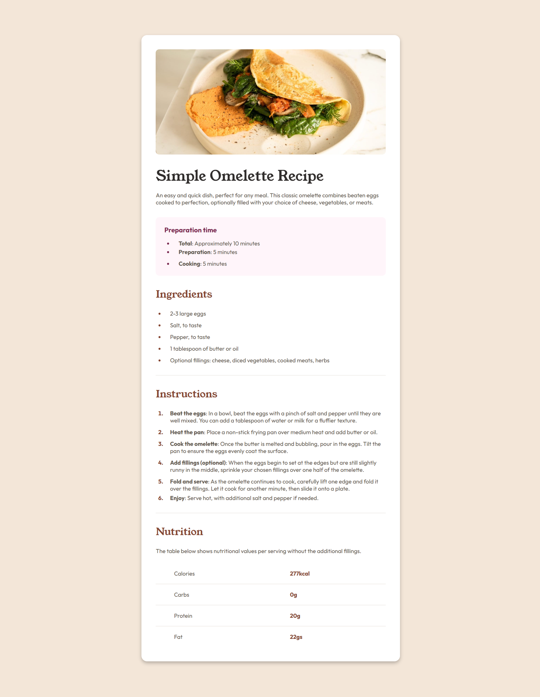

# Frontend Mentor - Recipe page

This is a solution to the [Recipe page challenge on Frontend Mentor](https://www.frontendmentor.io/challenges/recipe-page-KiTsR8QQKm). Frontend Mentor challenges help you improve your coding skills by building realistic projects. 

## Table of contents

- [Overview](#overview)
  - [Screenshot](#screenshot)
  - [Links](#links)
- [My process](#my-process)
  - [Built with](#built-with)
- [Author](#author)

## Overview

### Screenshot

### Links

- Solution URL: [Add solution URL here](https://www.frontendmentor.io/solutions/recipe-page-rAN4BR9s1r)
- Live Site URL: [Add live site URL here](https://daryna-g.github.io/Frontend-Mentor--Recipe-page/)

## My process

### Built with

- Semantic HTML5 markup
- CSS custom properties
- Flexbox

## Author
- Frontend Mentor - [@Daryna-g](https://www.frontendmentor.io/profile/Daryna-g)
